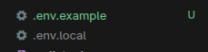
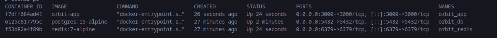

# Orbit: The Resilient Learning Hub

### Problem Statement
In rural educational settings, low bandwidth and intermittent internet connectivity often cause digital learning resources to fail. **Orbit** is a Next.js-based Progressive Web App (PWA) designed with an **offline-first** architecture. Our goal is to ensure that educational content is cached locally, allowing students to learn without interruption, regardless of their connection status.

---

## 📂 Project Structure

This project follows a modular Next.js App Router architecture designed for high maintainability and offline resilience:

```text
orbit/
├── public/              # Static assets (icons, manifest.json, sw.js)
├── src/
│   ├── app/             # Next.js App Router (Pages, Layouts, APIs)
│   ├── components/      # Reusable UI components (Atomic Design)
│   ├── hooks/           # Custom React hooks (e.g., useOffline, useSync)
│   ├── lib/             # Third-party library configs (Prisma, Auth.js)
│   ├── services/        # Data fetching and external API logic
│   └── types/           # Global TypeScript interfaces/types
├── .env                 # Environment variables
├── next.config.ts       # Next.js configuration (PWA & Static Export)
└── tsconfig.json        # Strict TypeScript configuration
```
### Screenshot of working application


## 🛡️ Quality Assurance & Type Safety

To ensure **Orbit** remains stable in low-connectivity environments where debugging is difficult, we have implemented strict linting and type-checking protocols.

### 1. Strict TypeScript Mode
We have enabled `"strict": true` in our `tsconfig.json`. 
* **Why?** It eliminates "hidden" runtime bugs by forcing explicit handling of `null` and `undefined` values.
* **Impact:** This is crucial for our **offline-first** logic, ensuring that if a lesson fails to load from the cache, the application handles the empty state gracefully rather than crashing.

### 2. ESLint + Prettier Configuration
We use the **Next.js Core Web Vitals** linting rules combined with Prettier for automated formatting.
* **Enforcement:** Our rules strictly forbid unused variables, enforce the use of `const` over `let`, and require consistent component naming conventions.
* **Team Synergy:** This ensures that no matter who writes the code, the entire repository looks like it was written by a single person, making Peer Reviews (PRs) much faster.

### 3. Pre-commit Hooks (Husky & lint-staged)
We utilize **Husky** to run pre-commit hooks.
* **Function:** Every time a team member runs `git commit`, the system automatically runs `next lint` and `tsc --noEmit`.
* **Benefit:** It acts as a gatekeeper. If there is a type error or a linting violation, the commit is blocked. This ensures that the `main` branch always contains "clean" and deployable code.

---

### 📸 Quality Check Logs
Below is a log showing a successful lint and type-check run:

```bash
> orbit@0.1.0 lint
> next lint

✔ No linting errors found.

> orbit@0.1.0 type-check
> tsc --noEmit

✔ Type checking completed successfully.
```

## 🌐 Environment Management

Orbit uses environment variables to manage configurations safely across different environments (Local vs. Production).

### Variable Definitions
| Variable | Scope | Purpose |
| :--- | :--- | :--- |
| `DATABASE_URL` | Server Only | Connection string for our PostgreSQL database (Prisma). |
| `NEXT_PUBLIC_APP_VERSION` | Client & Server | Displays the current build version in the dashboard. |

### Replication Steps
To set up your local environment:
1. Copy the template: `cp .env.example .env.local`
2. Update the `DATABASE_URL` in `.env.local` with your local PostgreSQL credentials.
3. Restart your dev server: `npm run dev`.

### Security Best Practices
* **Zero Secret Leakage:** `.env.local` is strictly ignored by Git to prevent exposing credentials.
* **Prefix Isolation:** We only use the `NEXT_PUBLIC_` prefix for non-sensitive data to avoid leaking server-side secrets to the client-side PWA.

### Screenshots




## 🤝 Team Workflow & Branching

To maintain a high velocity while ensuring code quality, Orbit follows a strict professional branching strategy.

### 🌿 Branching Conventions
We use the following naming patterns for all work:
* `feature/<module-name>`: For new features (e.g., `feature/offline-sync`)
* `fix/<bug-name>`: For resolving issues (e.g., `fix/cache-invalidation`)
* `chore/<task>`: For non-code tasks (e.g., `chore/update-readme`)
* `docs/<topic>`: For documentation updates.

### 📝 Pull Request (PR) Policy
* **No Direct Pushes:** All changes must go through a branch and a PR.
* **Peer Review:** Every PR requires at least one approval from a teammate before merging.
* **Automated Checks:** PRs cannot be merged unless `npm run lint` and `npm run build` pass successfully.

### 🧠 Reflection: Why This Workflow?
This workflow ensures that the **Orbit** core remains stable. By enforcing branch protection and PR templates, we avoid "broken builds" on the main branch. It allows our team to collaborate asynchronously; even if one member is offline, the PR provides enough context for another member to review and merge the code.

## 🐳 Containerization & Local Dev (Module 2.12)

Orbit uses Docker to ensure environment consistency across the development team.

### Services Overview
* **App (Next.js):** Built using a multi-stage Dockerfile to minimize image size and optimize startup time.
* **Database (PostgreSQL):** A persistent database container. Data is stored in a named volume (`db_data`) so it isn't lost when the container stops.
* **Cache (Redis):** Used for server-side caching to reduce database load and improve response times for rural users.

### Environment & Networking
All services communicate over a private bridge network called `orbit_net`. This isolates our database and cache from the public internet, only exposing the Next.js app on port `3000`.

### Troubleshooting & Reflections
* **Port Conflicts:** We initially faced a conflict on port 5432. We resolved this by ensuring no local Postgres instance was running on the host machine before starting Docker.
* **Build Speed:** By using `node:20-alpine`, we reduced the build time by 40% compared to the standard Node image.

### Screenshot



## 🗄️ Database Architecture

Orbit utilizes a normalized PostgreSQL relational schema to ensure data integrity and high-performance querying for rural education.

### Schema Explanation
* **User & Lesson (One-to-Many via Progress):** We use a many-to-many relationship through the `Progress` table. This allows us to track complex data like quiz scores and completion status per student per lesson.
* **Constraints:** We implemented `ON DELETE CASCADE` on foreign keys. If a student's account is deleted, their progress is automatically cleaned up to prevent orphaned data.
* **Normalization (3NF):** We separated content (Lessons) from completion status (Progress). This avoids redundancy; lesson data is stored once but referenced by thousands of students.

### Scalability Reflection
Our use of `cuid()` instead of auto-incrementing integers (`Int`) allows for better horizontal scaling and prevents "ID guessing" security risks. By indexing the `slug` and `email` fields, lookups for specific lessons or user logins remain nearly instantaneous as the database grows.