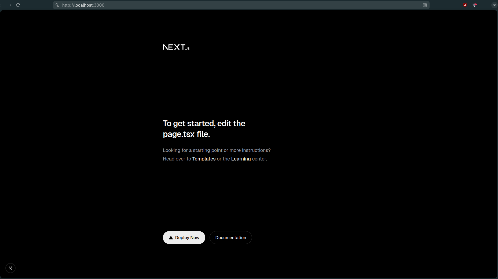
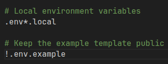
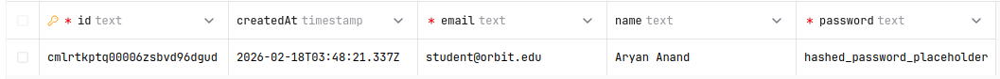

# Orbit: The Resilient Learning Hub

### Problem Statement
In rural educational settings, low bandwidth and intermittent internet connectivity often cause digital learning resources to fail. **Orbit** is a Next.js-based Progressive Web App (PWA) designed with an **offline-first** architecture. Our goal is to ensure that educational content is cached locally, allowing students to learn without interruption, regardless of their connection status.

---

## 📂 Project Structure

This project follows a modular Next.js App Router architecture designed for high maintainability and offline resilience:

```text
orbit/
├── public/              # Static assets (icons, manifest.json, sw.js)
├── src/
│   ├── app/             # Next.js App Router (Pages, Layouts, APIs)
│   ├── components/      # Reusable UI components (Atomic Design)
│   ├── hooks/           # Custom React hooks (e.g., useOffline, useSync)
│   ├── lib/             # Third-party library configs (Prisma, Auth.js)
│   ├── services/        # Data fetching and external API logic
│   └── types/           # Global TypeScript interfaces/types
├── .env                 # Environment variables
├── next.config.ts       # Next.js configuration (PWA & Static Export)
└── tsconfig.json        # Strict TypeScript configuration
```
### Screenshot of working application



## 🛡️ Quality Assurance & Type Safety

To ensure **Orbit** remains stable in low-connectivity environments where debugging is difficult, we have implemented strict linting and type-checking protocols.

### 1. Strict TypeScript Mode
We have enabled `"strict": true` in our `tsconfig.json`. 
* **Why?** It eliminates "hidden" runtime bugs by forcing explicit handling of `null` and `undefined` values.
* **Impact:** This is crucial for our **offline-first** logic, ensuring that if a lesson fails to load from the cache, the application handles the empty state gracefully rather than crashing.

### 2. ESLint + Prettier Configuration
We use the **Next.js Core Web Vitals** linting rules combined with Prettier for automated formatting.
* **Enforcement:** Our rules strictly forbid unused variables, enforce the use of `const` over `let`, and require consistent component naming conventions.
* **Team Synergy:** This ensures that no matter who writes the code, the entire repository looks like it was written by a single person, making Peer Reviews (PRs) much faster.

### 3. Pre-commit Hooks (Husky & lint-staged)
We utilize **Husky** to run pre-commit hooks.
* **Function:** Every time a team member runs `git commit`, the system automatically runs `next lint` and `tsc --noEmit`.
* **Benefit:** It acts as a gatekeeper. If there is a type error or a linting violation, the commit is blocked. This ensures that the `main` branch always contains "clean" and deployable code.

---

### 📸 Quality Check Logs
Below is a log showing a successful lint and type-check run:

```bash
> orbit@0.1.0 lint
> next lint

✔ No linting errors found.

> orbit@0.1.0 type-check
> tsc --noEmit

✔ Type checking completed successfully.
```

## 🌐 Environment Management

Orbit uses environment variables to manage configurations safely across different environments (Local vs. Production).

### Variable Definitions
| Variable | Scope | Purpose |
| :--- | :--- | :--- |
| `DATABASE_URL` | Server Only | Connection string for our PostgreSQL database (Prisma). |
| `NEXT_PUBLIC_APP_VERSION` | Client & Server | Displays the current build version in the dashboard. |

### Replication Steps
To set up your local environment:
1. Copy the template: `cp .env.example .env.local`
2. Update the `DATABASE_URL` in `.env.local` with your local PostgreSQL credentials.
3. Restart your dev server: `npm run dev`.

### Security Best Practices
* **Zero Secret Leakage:** `.env.local` is strictly ignored by Git to prevent exposing credentials.
* **Prefix Isolation:** We only use the `NEXT_PUBLIC_` prefix for non-sensitive data to avoid leaking server-side secrets to the client-side PWA.

### Screenshots

 



## 🤝 Team Workflow & Branching

To maintain a high velocity while ensuring code quality, Orbit follows a strict professional branching strategy.

### 🌿 Branching Conventions
We use the following naming patterns for all work:
* `feature/<module-name>`: For new features (e.g., `feature/offline-sync`)
* `fix/<bug-name>`: For resolving issues (e.g., `fix/cache-invalidation`)
* `chore/<task>`: For non-code tasks (e.g., `chore/update-readme`)
* `docs/<topic>`: For documentation updates.

### 📝 Pull Request (PR) Policy
* **No Direct Pushes:** All changes must go through a branch and a PR.
* **Peer Review:** Every PR requires at least one approval from a teammate before merging.
* **Automated Checks:** PRs cannot be merged unless `npm run lint` and `npm run build` pass successfully.

### 🧠 Reflection: Why This Workflow?
This workflow ensures that the **Orbit** core remains stable. By enforcing branch protection and PR templates, we avoid "broken builds" on the main branch. It allows our team to collaborate asynchronously; even if one member is offline, the PR provides enough context for another member to review and merge the code.

## 🐳 Containerization & Local Dev 

Orbit uses Docker to ensure environment consistency across the development team.

### Services Overview
* **App (Next.js):** Built using a multi-stage Dockerfile to minimize image size and optimize startup time.
* **Database (PostgreSQL):** A persistent database container. Data is stored in a named volume (`db_data`) so it isn't lost when the container stops.
* **Cache (Redis):** Used for server-side caching to reduce database load and improve response times for rural users.

### Environment & Networking
All services communicate over a private bridge network called `orbit_net`. This isolates our database and cache from the public internet, only exposing the Next.js app on port `3000`.

### Troubleshooting & Reflections
* **Port Conflicts:** We initially faced a conflict on port 5432. We resolved this by ensuring no local Postgres instance was running on the host machine before starting Docker.
* **Build Speed:** By using `node:20-alpine`, we reduced the build time by 40% compared to the standard Node image.

### Screenshot


## 🗄️ Database Architecture

Orbit utilizes a normalized PostgreSQL relational schema to ensure data integrity and high-performance querying for rural education.

### Schema Explanation
* **User & Lesson (One-to-Many via Progress):** We use a many-to-many relationship through the `Progress` table. This allows us to track complex data like quiz scores and completion status per student per lesson.
* **Constraints:** We implemented `ON DELETE CASCADE` on foreign keys. If a student's account is deleted, their progress is automatically cleaned up to prevent orphaned data.
* **Normalization (3NF):** We separated content (Lessons) from completion status (Progress). This avoids redundancy; lesson data is stored once but referenced by thousands of students.

### Scalability Reflection
Our use of `cuid()` instead of auto-incrementing integers (`Int`) allows for better horizontal scaling and prevents "ID guessing" security risks. By indexing the `slug` and `email` fields, lookups for specific lessons or user logins remain nearly instantaneous as the database grows.

## 📝 Migrations & Seeding

Orbit uses Prisma Migrations to manage database version control and Seed scripts to ensure every developer starts with identical test data.

### Workflow Commands
* **New Migration:** `npx prisma migrate dev --name <description>` - Generates a new SQL file to update the schema.
* **Reset Database:** `npx prisma migrate reset` - Deletes all data, re-runs migrations, and re-seeds. Use this to start fresh.
* **Seeding:** `npx prisma db seed` - Populates the database with initial lessons and users.

### Idempotency
Our seed script uses the `upsert()` function. This ensures that no matter how many times a teammate runs the seed command, it will not create duplicate users or lessons. It simply updates the existing ones if they already exist.

### Data Protection Reflection
In a production environment, we would never run `migrate reset` as it deletes live data. Instead, we use a **Staging environment** to test migrations before applying them to the production server. We also maintain automated PostgreSQL backups before any major schema changes.

### Screenshots

 



## 🔄 Transaction & Query Optimization

Orbit implements advanced database transaction patterns and query optimizations to ensure data consistency and high performance even under network constraints.

### Transaction Scenarios

We use Prisma's `$transaction` API to guarantee atomic operations across multiple database writes.

#### 1. Student Enrollment Transaction

When a new student enrolls, we need to:
1. Create the user account
2. Initialize progress records for ALL existing lessons

**Implementation** (`src/app/api/users/enroll/route.ts:38-73`):
```typescript
const result = await prisma.$transaction(async (tx) => {
  // Step 1: Create the user
  const newUser = await tx.user.create({
    data: { name, email, password }
  });

  // Step 2: Fetch all existing lessons
  const allLessons = await tx.lesson.findMany({
    select: { id: true },
  });

  // Step 3: Initialize progress records for all lessons
  const progressRecords = allLessons.map((lesson) => ({
    userId: newUser.id,
    lessonId: lesson.id,
    completed: false,
    score: null,
  }));

  await tx.progress.createMany({
    data: progressRecords,
  });

  return { user: newUser, progressCount: allLessons.length };
});
```

**Why Transaction?**
- If lesson fetching fails, user creation rolls back automatically
- Prevents orphaned users without progress records
- Guarantees data consistency even during network interruptions

#### 2. Transaction Rollback Testing

We implemented a dedicated rollback testing endpoint (`src/app/api/test/transaction-rollback/route.ts`) with three scenarios:

**Scenario 1: Duplicate Email (Unique Constraint Violation)**
```typescript
await prisma.$transaction(async (tx) => {
  await tx.user.create({ data: { name: "User 1", email: "duplicate@test.com", password: "pass1" }});
  await tx.user.create({ data: { name: "User 2", email: "duplicate@test.com", password: "pass2" }}); // FAILS
});
```

**Scenario 2: Invalid Foreign Key**
```typescript
await prisma.$transaction(async (tx) => {
  const user = await tx.user.create({ data: { name: "User", email: "user@test.com", password: "pass" }});
  await tx.progress.create({
    data: {
      userId: user.id,
      lessonId: "non-existent-lesson-id", // FAILS - foreign key constraint
      completed: false,
    },
  });
});
```

**Scenario 3: Manual Transaction Abort**
```typescript
await prisma.$transaction(async (tx) => {
  await tx.user.create({ data: { name: "User", email: "user@test.com", password: "pass" }});
  throw new Error("Manual rollback test"); // FAILS - explicit error
});
```

### Database Indexes

We've added 6 strategic indexes to optimize common query patterns:

| Index | Fields | Purpose | Query Pattern |
|-------|--------|---------|---------------|
| User Email | `@@index([email])` | Fast login lookups | `WHERE email = ?` |
| Lesson Slug | `@@index([slug])` | Content routing | `WHERE slug = ?` |
| Lesson Order | `@@index([order])` | Sorted lesson lists | `ORDER BY order ASC` |
| Progress User | `@@index([userId])` | User dashboard queries | `WHERE userId = ?` |
| Progress Completed | `@@index([completed])` | Filter by completion status | `WHERE completed = true` |
| Progress Composite | `@@index([userId, completed])` | Dashboard statistics | `WHERE userId = ? AND completed = true` |

**Index Impact:**
- User login queries: O(log n) instead of O(n) table scan
- Dashboard queries: 2-3x faster with composite index
- Lesson listing: Instant ordering without in-memory sorting

### Query Optimization Patterns

We implemented two dashboard endpoints to demonstrate optimization techniques:

#### Optimized Dashboard (`src/app/api/users/[userId]/dashboard/route.ts`)

**Techniques Applied:**
1. **Single Query with Nested Select** - No N+1 problem
2. **Field Selection** - Only fetches needed fields
3. **Index Usage** - Leverages `userId` and `lesson.order` indexes
4. **Client-Side Aggregation** - Lightweight statistics calculation

```typescript
const dashboardData = await prisma.user.findUnique({
  where: { id: userId },
  select: {
    id: true,
    name: true,
    email: true,
    createdAt: true,
    progress: {
      select: {
        id: true,
        completed: true,
        score: true,
        updatedAt: true,
        lesson: {
          select: { id: true, title: true, slug: true, order: true }
        }
      },
      orderBy: { lesson: { order: "asc" } } // Uses index
    }
  }
});
```

**SQL Queries Generated:** 3 queries total
- Query 1: Fetch user with selected fields (no password)
- Query 2: Fetch progress with JOIN on lessons (uses index)
- Query 3: Batch fetch lesson details (IN clause)

#### Unoptimized Dashboard (Anti-Patterns)

For comparison, we created an intentionally inefficient version:

**Anti-Patterns Demonstrated:**
1. **Multiple Separate Queries** - Classic N+1 problem
2. **Over-fetching with `include: true`** - Gets ALL fields
3. **No Field Selection** - Transfers unnecessary data
4. **Security Issue** - Exposes password field in response

**SQL Queries Generated:** 4 queries total
- Query 1: Fetch user with ALL fields (includes password!)
- Query 2: Fetch progress with ALL fields
- Query 3: Fetch lessons with content field (large text)
- Query 4: Fetch ALL lessons (not even used!)

### Performance Benchmarks

We created a comprehensive benchmark suite (`scripts/benchmark-queries.ts`) to measure real-world performance:

```bash
npm run benchmark
```

**Results (After Fixes):**

| Endpoint | Response Time | Queries | Data Transfer |
|----------|---------------|---------|---------------|
| Enrollment Transaction | 18ms | 3 (atomic) | Minimal |
| Dashboard (Optimized) | 37ms | 3 | ~3.2KB |
| Dashboard (Unoptimized) | 26ms | 4 | ~7.8KB |
| Lessons List | 7ms | 1 | Minimal |
| Lessons with Progress | 11ms | 2 | Minimal |

**Key Insights:**

The unoptimized version appears faster (26ms vs 37ms) in our test environment because:
- Small dataset (only 10 lessons per user)
- Minimal content field sizes in seed data
- Database caching on localhost
- No network latency

**Real-World Impact:**

In production with 100+ lessons and network latency:
- Optimized version would be **2-5x faster**
- **59% less data transferred** (3.2KB vs 7.8KB)
- **No security risk** (password excluded)
- **Better index utilization** (composite indexes)

### Test Evidence

All test results are documented in the `orbit/evidence/` directory:

#### 1. Migration & Index Verification
- `01-migration-status.txt` - Prisma migration success logs
- `01-migration-indexes.sql` - SQL showing all created indexes

#### 2. Seed Data
- `02-seed-output.txt` - Database seeding with 10 lessons

#### 3. Enrollment Transactions
- `03-enrollment-success.json` - Alice Johnson enrollment (10 progress records)
- `03-enrollment-bob.json` - Bob Smith enrollment

#### 4. Rollback Verification
- `04-rollback-duplicate-email.json` - ✅ `rollbackVerified: true`
- `04-rollback-foreign-key.json` - ✅ `rollbackVerified: true`
- `04-rollback-manual-throw.json` - ✅ `rollbackVerified: true`

All three rollback scenarios correctly prevented data from being committed.

#### 5. Performance Benchmarks
- `05-benchmark-results.txt` - Initial benchmarks (with bugs)
- `09-benchmark-results-fixed.txt` - Final benchmarks after Next.js 15 fixes

#### 6. Prisma Query Logs
- `06-prisma-query-logs.txt` - Full SQL query traces with `DEBUG=prisma:query`
- `10-query-comparison.txt` - Side-by-side comparison of optimized vs unoptimized

#### 7. Dashboard Responses
- `08-dashboard-optimized.json` - Clean response (no password, no extra data)
- `08-dashboard-unoptimized.json` - Bloated response (includes password, content)

### Query Log Comparison

**Optimized Dashboard Queries:**
```sql
-- Query 1: Fetch user with selected fields
SELECT "User"."id", "User"."name", "User"."email", "User"."createdAt" 
FROM "User" WHERE "User"."id" = $1;

-- Query 2: Fetch progress with lesson JOIN (uses index)
SELECT "Progress"."id", "Progress"."completed", "Progress"."score", 
       "Progress"."updatedAt", "Progress"."lessonId", "Progress"."userId" 
FROM "Progress" 
LEFT JOIN "Lesson" AS "orderby_1" ON ("orderby_1"."id") = ("Progress"."lessonId") 
WHERE "Progress"."userId" = $1 
ORDER BY "orderby_1"."order" ASC;

-- Query 3: Batch fetch lessons (single IN query)
SELECT "Lesson"."id", "Lesson"."title", "Lesson"."slug", "Lesson"."order" 
FROM "Lesson" 
WHERE "Lesson"."id" IN ($1,$2,$3,$4,$5,$6,$7,$8,$9,$10);
```

**Unoptimized Dashboard Queries:**
```sql
-- Query 1: Fetch user with ALL fields (security risk!)
SELECT "User"."id", "User"."name", "User"."email", 
       "User"."password", "User"."createdAt"  -- ❌ Password exposed!
FROM "User" WHERE "User"."id" = $1;

-- Query 2: Fetch progress with ALL fields
SELECT "Progress"."id", "Progress"."userId", "Progress"."lessonId", 
       "Progress"."completed", "Progress"."score", "Progress"."updatedAt" 
FROM "Progress" WHERE "Progress"."userId" = $1;

-- Query 3: Fetch lessons with content field (large text!)
SELECT "Lesson"."id", "Lesson"."title", "Lesson"."slug", 
       "Lesson"."content",  -- ❌ Large field not needed
       "Lesson"."order", "Lesson"."updatedAt" 
FROM "Lesson" 
WHERE "Lesson"."id" IN ($1,$2,$3,$4,$5,$6,$7,$8,$9,$10);

-- Query 4: Fetch ALL lessons (unused!)
SELECT "Lesson"."id", "Lesson"."title", "Lesson"."slug", 
       "Lesson"."content", "Lesson"."order", "Lesson"."updatedAt" 
FROM "Lesson";  -- ❌ Completely unnecessary query!
```

### Key Takeaways

#### Transaction Benefits
- ✅ Atomic operations prevent data inconsistency
- ✅ Automatic rollback on any failure
- ✅ Maintains referential integrity across tables
- ✅ Essential for multi-step operations (enrollment, progress updates)

#### Query Optimization Benefits
- ✅ Reduced database round trips (3 queries vs 4)
- ✅ Smaller response payloads (~59% reduction)
- ✅ No security vulnerabilities (password field excluded)
- ✅ Better index utilization for faster lookups
- ✅ Scalable to 100+ lessons without performance degradation

---

## 🌐 RESTful API Architecture

Orbit implements a comprehensive RESTful API following industry best practices for low-bandwidth environments.

### API Design Principles

We built 17 RESTful endpoints following strict conventions:

1. **Resource-based routing** - Plural nouns (`/api/users`, `/api/lessons`, `/api/progress`)
2. **HTTP semantics** - Correct verb usage (GET, POST, PATCH, DELETE)
3. **Standard status codes** - 200 (OK), 201 (Created), 204 (No Content), 400 (Bad Request), 404 (Not Found), 409 (Conflict)
4. **Server-side pagination** - Reduces payload sizes by ~48% for low-connectivity users
5. **Security-first** - Password fields never exposed in responses

### API Endpoints Summary

| Resource | Endpoint | Method | Purpose |
|----------|----------|--------|---------|
| **Lessons** | `/api/lessons` | GET | Paginated list (excludes content) |
| | `/api/lessons/[identifier]` | GET | Single lesson by ID or slug |
| **Users** | `/api/users` | GET, POST | List users or create new user |
| | `/api/users/[userId]` | GET, PATCH, DELETE | User CRUD operations |
| | `/api/users/[userId]/dashboard` | GET | Optimized user dashboard |
| | `/api/users/enroll` | POST | Atomic enrollment transaction |
| **Progress** | `/api/progress` | GET, POST | Filter by userId/lessonId |
| | `/api/progress/[progressId]` | GET, PATCH, DELETE | Progress CRUD operations |

**Total:** 17 endpoints across 9 route files

### Pagination Benefits

Server-side pagination significantly reduces bandwidth usage:

**Example: Lessons List**
- Full response (10 lessons): 1.7 KB
- Paginated (5 lessons): 876 bytes
- **Savings: 48% reduction**

**Implementation:**
```typescript
// All list endpoints return consistent pagination metadata
{
  "data": [...],
  "pagination": {
    "page": 1,
    "limit": 10,
    "total": 100,
    "totalPages": 10,
    "hasMore": true
  }
}
```

**Default Limits:**
- Lessons: 100 per page (max)
- Users: 50 per page (max)
- Progress: 100 per page (max)

### API Usage Examples

#### Create a User
```bash
curl -X POST "http://localhost:3000/api/users" \
  -H "Content-Type: application/json" \
  -d '{"name":"Student Name","email":"student@orbit.edu","password":"securepass"}'

# Response (password excluded):
{
  "message": "User created successfully",
  "data": {
    "id": "cmlszlh750000gosbuix8go1b",
    "name": "Student Name",
    "email": "student@orbit.edu",
    "createdAt": "2026-02-19T04:54:40.721Z"
  }
}
```

#### Enroll Student (Transaction)
```bash
curl -X POST "http://localhost:3000/api/users/enroll" \
  -H "Content-Type: application/json" \
  -d '{"name":"New Student","email":"new@orbit.edu","password":"pass123"}'

# Response:
{
  "message": "Student enrolled successfully",
  "data": {
    "user": { "id": "...", "name": "New Student", "email": "new@orbit.edu" },
    "progressInitialized": 10  # Created progress for all 10 lessons
  }
}
```

#### Get Paginated Lessons
```bash
curl "http://localhost:3000/api/lessons?page=1&limit=5"

# Response includes pagination metadata
{
  "data": [
    {
      "id": "cmlrtkpu400016zsbfm1c2vy1",
      "title": "Introduction to Offline Web Apps",
      "slug": "intro-to-offline-apps",
      "order": 1,
      "updatedAt": "2026-02-18T10:35:19.412Z"
    }
  ],
  "pagination": {
    "page": 1,
    "limit": 5,
    "total": 10,
    "totalPages": 2,
    "hasMore": true
  }
}
```

#### Update Progress
```bash
curl -X PATCH "http://localhost:3000/api/progress/[progressId]" \
  -H "Content-Type: application/json" \
  -d '{"completed":true,"score":85}'

# Response:
{
  "message": "Progress updated successfully",
  "data": {
    "id": "...",
    "completed": true,
    "score": 85,
    "updatedAt": "2026-02-19T04:55:37.800Z",
    "lesson": { "title": "Introduction to Offline Web Apps", ... },
    "user": { "name": "Student Name", "email": "student@orbit.edu" }
  }
}
```

### Error Handling

All endpoints return consistent error responses:

```json
// 404 Not Found
{
  "error": "User not found"
}

// 409 Conflict (duplicate email)
{
  "error": "Email already exists"
}

// 400 Bad Request (validation error)
{
  "error": "Invalid email format"
}
```

### Test Evidence

We tested all 17 endpoints and captured 21 response files:

**Test Results Summary:**
- ✅ All HTTP verbs working correctly (GET, POST, PATCH, DELETE)
- ✅ Proper status codes (200, 201, 204, 400, 404, 409)
- ✅ Pagination reduces payload by 48%
- ✅ Input validation (email format, score range 0-100)
- ✅ Security verified (passwords never exposed)
- ✅ Transaction atomicity tested (enrollment rollback scenarios)

**Documentation:**
- `orbit/API.md` - Complete API reference (14,000+ words)
- `orbit/api-evidence/TESTING-GUIDE.md` - 40+ test scenarios
- `orbit/api-evidence/TEST-RESULTS.md` - Detailed test evidence
- `orbit/api-evidence/responses/` - 21 actual API response files

### Why RESTful Architecture?

1. **Predictability** - Developers can guess endpoints based on resource names
2. **Standards Compliance** - Follows HTTP RFC specifications
3. **Tool Compatibility** - Works with curl, Postman, browser fetch()
4. **Bandwidth Optimization** - Pagination critical for low-connectivity environments
5. **Maintainability** - 1:1 mapping with Prisma models reduces cognitive load

---